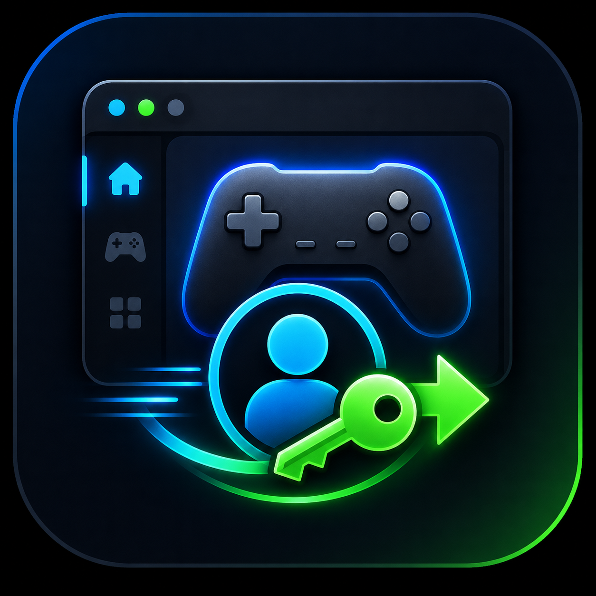

<p align="center">
  
</p>

<h1 align="center">Ubisoft Auto Login</h1>

<p align="center">
  <strong>A quiet Windows tray utility for those moments when Ubisoft Connect forgets you.</strong>
</p>

Small Windows tray app that listens passively for Ubisoft Connect login windows and fills the saved Ubisoft password only when the foreground window is verified as Ubisoft-owned.

## Requirements

- Windows 10/11
- .NET 8 SDK or newer
- Ubisoft Connect installed

## Build

```powershell
dotnet restore
dotnet build -c Release
```

## Run

```powershell
dotnet run -c Release
```

On first run, the tray app prompts for username/email and password. They are stored in Windows Credential Manager under:

- `UbisoftAutoLogin:Username`
- `UbisoftAutoLogin:Password`

Non-secret settings are stored at:

```text
%AppData%\UbisoftAutoLogin\config.json
```

Logs are written to:

```text
%AppData%\UbisoftAutoLogin\logs\app.log
```

The log intentionally does not write credential values.

## Efficiency Model

The app does not run a timer loop and does not poll every second. It installs passive `SetWinEventHook` subscriptions for window create/show/foreground events, then returns to the WinForms message loop until Windows delivers a relevant event.

The hook is always registered while the tray app is running because that is how it notices Ubisoft Connect appearing. When Ubisoft is not running, the callback only does cheap HWND checks and exits. It filters to visible, non-minimized, roughly login-sized root windows before resolving the process name, then only acts on `upc.exe`, `UbisoftConnect.exe`, or `UbisoftGameLauncher.exe`.

Each candidate HWND is debounced, and synthetic input is only attempted after foreground verification confirms the target is still Ubisoft-owned.

## Tray Menu

- `Set / Update Credentials`
- `Test Fill Current Ubisoft Window`
- `Exit`

## Config

Default `config.json`:

```json
{
  "PasswordBoxXPercent": 0.5,
  "PasswordBoxYPercent": 0.58,
  "DelayBeforeFillMs": 2500,
  "DebounceMs": 15000
}
```

Coordinate fallback only runs after the exact Ubisoft window is activated and re-verified as foreground. The app checks foreground ownership before every synthetic text character and before pressing Enter.

## Release Process

1. Update `VERSION` with the new SemVer value.
2. Add a matching `## [x.y.z] - YYYY-MM-DD` section to `CHANGELOG.md`.
3. Push to `main` or `master`.

GitHub Actions builds the app, creates a `vx.y.z` tag and GitHub release if that version has not already been released, uses the matching changelog section as the release notes, and attaches both the Windows zip and `CHANGELOG-vx.y.z.md`.
